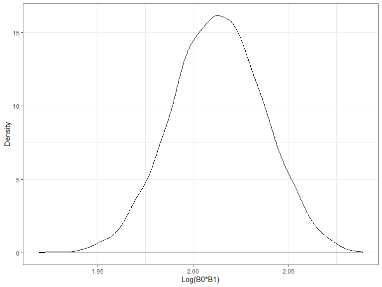

Homework 6
================
Sarah McLarnan
2019-11-19

### Problem 1

``` r
birthweight = read_csv("./data/birthweight.csv")
```

    ## Parsed with column specification:
    ## cols(
    ##   .default = col_double()
    ## )

    ## See spec(...) for full column specifications.

``` r
birthweight = 
  birthweight %>%
  drop_na() %>%
  mutate(
    babysex = factor(babysex),
    babysex = recode(babysex, "1" = "male", "2" = "female"),
    frace = factor (frace),
    frace = recode(frace, "1" = "white", "2" = "black", "3" = "asian", "4" = "puerto rican", "8" = "other", "9" = "unkown"),
    malform = factor(malform), 
    malform = recode(malform, "0" = "absent", "1" = "present"),
    mrace = factor(mrace), 
    mrace = recode(mrace, "1" = "white", "2" = "black", "3" = "asian", "4" = "puerto rican", "8" = "other")
  )
```

``` r
bw_model = lm(bwt ~ gaweeks + blength + fincome + wtgain, data = birthweight)

birthweight %>%
  add_residuals(bw_model) %>%
  add_predictions(bw_model) %>%
  ggplot(aes(x = pred, y = resid)) +
          geom_point() +
          labs (x = "Prediction", y = "Residual", title = "Residuals by Prediction of Proposed Birthweight Model")
```


``` r
comp_model1 = lm(bwt ~ gaweeks + blength, data = birthweight)
comp_model2 = lm(bwt ~ babysex * blength * bhead, data = birthweight)
```

``` r
cv_df = 
  crossv_mc(birthweight, 100)

cv_df = cv_df %>% 
  mutate(bw_model  = map(train, ~lm(bwt ~ gaweeks + blength + fincome + wtgain, data = .x)),
         comp_model1  = map(train, ~lm(bwt ~ blength + gaweeks, data = .x)),
         comp_model2  = map(train, ~lm(bwt ~ bhead + blength + babysex +  bhead*blength + bhead*babysex + blength*babysex + bhead*blength*babysex, data = .x))) %>% 
  mutate(rmse_1 = map2_dbl(bw_model, test, ~modelr::rmse(model = .x, data = .y)),
         rmse_2 = map2_dbl(comp_model1, test, ~modelr::rmse(model = .x, data = .y)),
         rmse_3 = map2_dbl(comp_model2, test, ~modelr::rmse(model = .x, data = .y)))

cv_plot = cv_df %>% 
  select(starts_with("rmse")) %>% 
pivot_longer(
    everything(),
    names_to = "model", 
    values_to = "rmse",
    names_prefix = "rmse_") %>% 
  mutate(model = fct_inorder(model)) %>% 
  ggplot(aes(x = model, y = rmse)) + geom_violin()
cv_plot 
```


### Problem 2

``` r
weather_df = 
  rnoaa::meteo_pull_monitors(
    c("USW00094728"),
    var = c("PRCP", "TMIN", "TMAX"), 
    date_min = "2017-01-01",
    date_max = "2017-12-31") %>%
  mutate(
    name = recode(id, USW00094728 = "CentralPark_NY"),
    tmin = tmin / 10,
    tmax = tmax / 10) %>%
  select(name, id, everything())
```

    ## Registered S3 method overwritten by 'crul':
    ##   method                 from
    ##   as.character.form_file httr

    ## Registered S3 method overwritten by 'hoardr':
    ##   method           from
    ##   print.cache_info httr

    ## file path:          C:\Users\Sarah\AppData\Local\rnoaa\rnoaa\Cache/ghcnd/USW00094728.dly

    ## file last updated:  2019-09-26 10:27:30

    ## file min/max dates: 1869-01-01 / 2019-09-30

``` r
bootstraps = 
  weather_df %>%
  bootstrap(n = 5000) %>%
  mutate(
    model = map(strap, ~lm(tmax ~ tmin, data = .x)), 
    b0b1 = map(model, broom::tidy),
    r2 = map(model, broom::glance))

b0b1 = 
  bootstraps %>%
    select(-strap, -model, -r2) %>% 
    unnest(b0b1) %>% 
    select(-std.error, -statistic, -p.value) %>%
    pivot_wider(
       names_from = term,
       values_from = estimate
    ) %>% 
    rename(beta1 = tmin, beta0 = `(Intercept)`) %>% 
   mutate(log = log(beta0*beta1)) %>%
  ggplot(aes(x = log)) + 
  geom_density()

b0b1
```



``` r
r2 = 
  bootstraps %>%
  select(r2) %>%
  unnest(r2) %>%
  ggplot(aes(x = r.squared)) +
           geom_density()

r2
```


